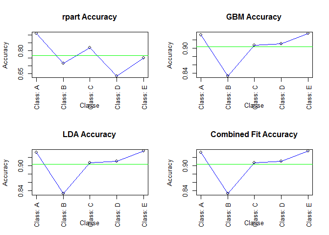
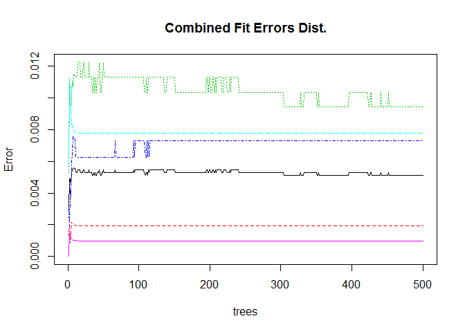

# PML Course Project
Anil Puppala  
May 1, 2016  


## Introduction

Using devices such as Jawbone Up, Nike FuelBand, and Fitbit it is now possible to collect a large amount of data about personal activity relatively inexpensively. These type of devices are part of the quantified self movement - a group of enthusiasts who take measurements about themselves regularly to improve their health, to find patterns in their behavior, or because they are tech geeks. One thing that people regularly do is quantify how much of a particular activity they do, but they rarely quantify how well they do it. In this project, your goal will be to use data from accelerometers on the belt, forearm, arm, and dumbell of 6 participants. They were asked to perform barbell lifts correctly and incorrectly in 5 different ways.

In this project we will use the data generated by these devices to create a model/models to predict the manner in which the 6 subjects did the exercise, and apply the same learning (model) to predict 20 external cases as well.

The manner of exercise, which is the outcome in this analysis, is a factor variable with 5 levels. The five levels are: 'A', 'B', 'C', 'D', and 'E'.

## Loading Data

```r
library(rattle)
```

```
## Warning: package 'rattle' was built under R version 3.2.5
```

```
## Rattle: A free graphical interface for data mining with R.
## Version 4.1.0 Copyright (c) 2006-2015 Togaware Pty Ltd.
## Type 'rattle()' to shake, rattle, and roll your data.
```

```r
library(randomForest)
```

```
## Warning: package 'randomForest' was built under R version 3.2.5
```

```
## randomForest 4.6-12
## Type rfNews() to see new features/changes/bug fixes.
```

```r
library(ggplot2)
```

```
## Warning: package 'ggplot2' was built under R version 3.2.3
```

```
## 
## Attaching package: 'ggplot2'
## 
## The following object is masked from 'package:randomForest':
## 
##     margin
```

```r
library(caret)
```

```
## Warning: package 'caret' was built under R version 3.2.4
```

```
## Loading required package: lattice
```

```
## Warning: package 'lattice' was built under R version 3.2.2
```

```r
library(forecast)
```

```
## Warning: package 'forecast' was built under R version 3.2.5
```

```
## Loading required package: zoo
```

```
## Warning: package 'zoo' was built under R version 3.2.1
```

```
## 
## Attaching package: 'zoo'
## 
## The following objects are masked from 'package:base':
## 
##     as.Date, as.Date.numeric
## 
## Loading required package: timeDate
```

```
## Warning: package 'timeDate' was built under R version 3.2.3
```

```
## This is forecast 7.1
```

```r
set.seed(77789)

sample <- read.csv("C:/R study material/Practical Machine Learning/pml-training.csv", na.strings=c("NA","#DIV/0!",""))
assign20 <- read.csv("C:/R study material/Practical Machine Learning/pml-testing.csv", na.strings=c("NA","#DIV/0!",""))
```

## Cross validation datasets - with training, testing and validation
I'm using three datasets. 1) Training, 2) Testing, and 3) Validation

```r
inBuild <- createDataPartition(y=sample$classe, p=0.7, list=FALSE)
validation <- sample[-inBuild,]; 
buildData <- sample[inBuild,]

inTrain <- createDataPartition(y=buildData$classe,  p=0.6, list=FALSE)
training <- buildData[inTrain,]; 
testing <- buildData[-inTrain,]
```

## Cleaning Data & Variable Reduction
The below code removes the features with near zero variability variables, variables with 65% 'NA's. Since the outcome is a categorical variable, I'm using non-parametric classification analysis. The analysis combines three models using caret platform. The three methods are: 1) CART Tree (rpart), 2) Gradient Boosted, and 3) Linear Discriminant Analysis


```r
training <- training[,-1]

varvar <- nearZeroVar(training, saveMetrics = T)
finvars <- varvar[,4]==FALSE
new_training <- training[,finvars]

finaltrain <- new_training 

for(gg in 1:length(new_training)) { 
  if( sum( is.na( new_training[, gg] ) ) /nrow(new_training) >= .5 ) { 
    for(kk in 1:length(finaltrain)) {
      if( length( grep(names(new_training[gg]), names(finaltrain)[kk]) ) ==1)  { 
        finaltrain <- finaltrain[ , -kk] 
      }   
    } 
  }
}
```

## Fitting Three Competing Models


```
## Loading required package: rpart
```

```
## Warning: package 'rpart' was built under R version 3.2.2
```

```
## Loading required package: gbm
```

```
## Warning: package 'gbm' was built under R version 3.2.5
```

```
## Loading required package: survival
```

```
## Warning: package 'survival' was built under R version 3.2.2
```

```
## 
## Attaching package: 'survival'
## 
## The following object is masked from 'package:caret':
## 
##     cluster
## 
## Loading required package: splines
## Loading required package: parallel
## Loaded gbm 2.1.1
## Loading required package: plyr
```

```
## Warning: package 'plyr' was built under R version 3.2.1
```

```
## Loading required package: MASS
```

```
## Warning: package 'MASS' was built under R version 3.2.3
```

```
## Warning in lda.default(x, grouping, ...): variables are collinear
```

```
## Warning in lda.default(x, grouping, ...): variables are collinear
```

```
## Warning in lda.default(x, grouping, ...): variables are collinear
```

```
## Warning in lda.default(x, grouping, ...): variables are collinear
```

```
## Warning in lda.default(x, grouping, ...): variables are collinear
```

```
## Warning in lda.default(x, grouping, ...): variables are collinear
```

```
## Warning in lda.default(x, grouping, ...): variables are collinear
```

```
## Warning in lda.default(x, grouping, ...): variables are collinear
```

```
## Warning in lda.default(x, grouping, ...): variables are collinear
```

```
## Warning in lda.default(x, grouping, ...): variables are collinear
```

```
## Warning in lda.default(x, grouping, ...): variables are collinear
```

```
## Warning in lda.default(x, grouping, ...): variables are collinear
```

```
## Warning in lda.default(x, grouping, ...): variables are collinear
```

```
## Warning in lda.default(x, grouping, ...): variables are collinear
```

```
## Warning in lda.default(x, grouping, ...): variables are collinear
```

```
## Warning in lda.default(x, grouping, ...): variables are collinear
```

```
## Warning in lda.default(x, grouping, ...): variables are collinear
```

```
## Warning in lda.default(x, grouping, ...): variables are collinear
```

```
## Warning in lda.default(x, grouping, ...): variables are collinear
```

```
## Warning in lda.default(x, grouping, ...): variables are collinear
```

```
## Warning in lda.default(x, grouping, ...): variables are collinear
```

```
## Warning in lda.default(x, grouping, ...): variables are collinear
```

```
## Warning in lda.default(x, grouping, ...): variables are collinear
```

```
## Warning in lda.default(x, grouping, ...): variables are collinear
```

```
## Warning in lda.default(x, grouping, ...): variables are collinear
```

```
## Warning in lda.default(x, grouping, ...): variables are collinear
```

## Predicting the competing models with the out of sample (testing) set


```r
predFit1 <- predict(fit1, newdata = testing)
predFit2 <- predict(fit2, newdata = testing)
predFit3 <- predict(fit3, newdata = testing)
```

## Combining the three outcomes to fit a combined prediction


```r
predDF <- data.frame(predFit1, predFit2, predFit3, classe=testing$classe)
combFit <- train(classe ~ ., data = predDF)
predCombine <- predict(combFit, newdata = predDF)
```

## Compute accuracy of all three and the combined model


```r
testConfu1 <- confusionMatrix(predFit1, testing$classe)
testConfu2 <- confusionMatrix(predFit2, testing$classe)
testConfu3 <- confusionMatrix(predFit3, testing$classe)
testConfu4 <- confusionMatrix(predCombine, testing$classe)
```


## Predicting the out of sample (validation) sample

```r
validfit1 <- predict(fit1, newdata=validation)
validfit2 <- predict(fit3, newdata=validation)
validfit3 <- predict(fit3, newdata=validation)
```

## Prepare dataset for the combined prediction on the validation sample

```r
validDF <- data.frame(predFit1=validfit1, predFit2=validfit2, predFit3=validfit3)
predValid <- predict(combFit, validDF)
```

## Compare the accuracy for all the four models

```r
valitConfu1 <- confusionMatrix(validfit1, validation$classe)
valitConfu2 <- confusionMatrix(validfit2, validation$classe)
valitConfu3 <- confusionMatrix(validfit3, validation$classe)
valitConfu4 <- confusionMatrix(predValid, validation$classe)
valitConfu1
```

```
## Confusion Matrix and Statistics
## 
##           Reference
## Prediction    A    B    C    D    E
##          A 1457  113   11   38   65
##          B   27  535   37   50   72
##          C  182  485  976  588  272
##          D    0    6    2  288  128
##          E    8    0    0    0  545
## 
## Overall Statistics
##                                           
##                Accuracy : 0.6459          
##                  95% CI : (0.6335, 0.6581)
##     No Information Rate : 0.2845          
##     P-Value [Acc > NIR] : < 2.2e-16       
##                                           
##                   Kappa : 0.5527          
##  Mcnemar's Test P-Value : < 2.2e-16       
## 
## Statistics by Class:
## 
##                      Class: A Class: B Class: C Class: D Class: E
## Sensitivity            0.8704  0.46971   0.9513  0.29876  0.50370
## Specificity            0.9461  0.96081   0.6857  0.97236  0.99833
## Pos Pred Value         0.8652  0.74202   0.3899  0.67925  0.98553
## Neg Pred Value         0.9483  0.88304   0.9852  0.87621  0.89929
## Prevalence             0.2845  0.19354   0.1743  0.16381  0.18386
## Detection Rate         0.2476  0.09091   0.1658  0.04894  0.09261
## Detection Prevalence   0.2862  0.12251   0.4253  0.07205  0.09397
## Balanced Accuracy      0.9082  0.71526   0.8185  0.63556  0.75102
```

```r
valitConfu2
```

```
## Confusion Matrix and Statistics
## 
##           Reference
## Prediction    A    B    C    D    E
##          A 1506  155    1    0    0
##          B  144  818   97    2    0
##          C   24  161  897   96    6
##          D    0    5   30  824  125
##          E    0    0    1   42  951
## 
## Overall Statistics
##                                          
##                Accuracy : 0.8489         
##                  95% CI : (0.8395, 0.858)
##     No Information Rate : 0.2845         
##     P-Value [Acc > NIR] : < 2.2e-16      
##                                          
##                   Kappa : 0.8091         
##  Mcnemar's Test P-Value : NA             
## 
## Statistics by Class:
## 
##                      Class: A Class: B Class: C Class: D Class: E
## Sensitivity            0.8996   0.7182   0.8743   0.8548   0.8789
## Specificity            0.9630   0.9488   0.9409   0.9675   0.9910
## Pos Pred Value         0.9061   0.7710   0.7576   0.8374   0.9567
## Neg Pred Value         0.9602   0.9335   0.9726   0.9714   0.9732
## Prevalence             0.2845   0.1935   0.1743   0.1638   0.1839
## Detection Rate         0.2559   0.1390   0.1524   0.1400   0.1616
## Detection Prevalence   0.2824   0.1803   0.2012   0.1672   0.1689
## Balanced Accuracy      0.9313   0.8335   0.9076   0.9111   0.9350
```

```r
valitConfu3
```

```
## Confusion Matrix and Statistics
## 
##           Reference
## Prediction    A    B    C    D    E
##          A 1506  155    1    0    0
##          B  144  818   97    2    0
##          C   24  161  897   96    6
##          D    0    5   30  824  125
##          E    0    0    1   42  951
## 
## Overall Statistics
##                                          
##                Accuracy : 0.8489         
##                  95% CI : (0.8395, 0.858)
##     No Information Rate : 0.2845         
##     P-Value [Acc > NIR] : < 2.2e-16      
##                                          
##                   Kappa : 0.8091         
##  Mcnemar's Test P-Value : NA             
## 
## Statistics by Class:
## 
##                      Class: A Class: B Class: C Class: D Class: E
## Sensitivity            0.8996   0.7182   0.8743   0.8548   0.8789
## Specificity            0.9630   0.9488   0.9409   0.9675   0.9910
## Pos Pred Value         0.9061   0.7710   0.7576   0.8374   0.9567
## Neg Pred Value         0.9602   0.9335   0.9726   0.9714   0.9732
## Prevalence             0.2845   0.1935   0.1743   0.1638   0.1839
## Detection Rate         0.2559   0.1390   0.1524   0.1400   0.1616
## Detection Prevalence   0.2824   0.1803   0.2012   0.1672   0.1689
## Balanced Accuracy      0.9313   0.8335   0.9076   0.9111   0.9350
```

```r
valitConfu4
```

```
## Confusion Matrix and Statistics
## 
##           Reference
## Prediction    A    B    C    D    E
##          A 1506  155    1    0    0
##          B  144  818   97    2    0
##          C   24  161  897   96    6
##          D    0    5   30  824  125
##          E    0    0    1   42  951
## 
## Overall Statistics
##                                          
##                Accuracy : 0.8489         
##                  95% CI : (0.8395, 0.858)
##     No Information Rate : 0.2845         
##     P-Value [Acc > NIR] : < 2.2e-16      
##                                          
##                   Kappa : 0.8091         
##  Mcnemar's Test P-Value : NA             
## 
## Statistics by Class:
## 
##                      Class: A Class: B Class: C Class: D Class: E
## Sensitivity            0.8996   0.7182   0.8743   0.8548   0.8789
## Specificity            0.9630   0.9488   0.9409   0.9675   0.9910
## Pos Pred Value         0.9061   0.7710   0.7576   0.8374   0.9567
## Neg Pred Value         0.9602   0.9335   0.9726   0.9714   0.9732
## Prevalence             0.2845   0.1935   0.1743   0.1638   0.1839
## Detection Rate         0.2559   0.1390   0.1524   0.1400   0.1616
## Detection Prevalence   0.2824   0.1803   0.2012   0.1672   0.1689
## Balanced Accuracy      0.9313   0.8335   0.9076   0.9111   0.9350
```

## Predicting the 20 sample
The combined fit's accuracy is exactly as accurate as the rpart fit. I used the combined fit to predict the 20 sample

```r
as20Fit1 <- predict(fit1, newdata = assign20)
as20Fit2 <- predict(fit2, newdata = assign20)
as20Fit3 <- predict(fit3, newdata = assign20)

as20CombDat <- data.frame(predFit1=as20Fit1, predFit2=as20Fit2, predFit3=as20Fit3)

as20ComFit <- predict(combFit, newdata = as20CombDat)

as20ComFit
```

```
##  [1] B A B A A E D B A A B C B A E E A B B B
## Levels: A B C D E
```

## Conclusion
I used the combined fit instead of rpart fit even though the accuracy is the same (refer to Appendix - Figure-1). I used it as the Error distribution shows lower variability (refer to Appendix - Figure-2).

##Appendix

Figure-1
 

Figure-2
 
